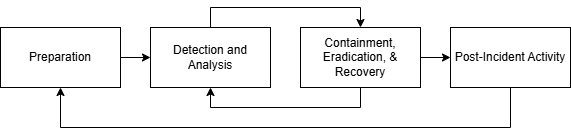

# COMSECS7
| Group Name | COMSECS7 (Computer Security 7) |
| :--- | :--- |
| **Group Members** | Peñada, Genova, Rumbaoa, Laus |

--

# Case 2: Perimeter Breach via N-Day Vulnerability
Threat actors exploit a known, unpatched vulnerability in the bank's perimeter SSL VPN devices. They bypass multi-factor authentication, gain a foothold in the network, and begin encrypting file servers. Your playbook must heavily address the failure in patch management and how to eradicate the attackers' access. 

---

# Financial Resilience Playbook

---

# The Resilience Triad 

* **Risk Management:** Stop ongoing attacks by enforcing MFA across public systems, isolating servers, and securing offline backups. 
* **Business Continuity:** Keep Tier 1 operations running using manual workflows, temporary secure cloud storage, and emergency vendor support.
* **Disaster Recovery:** Restore strictly from clean, verified offline backups and rebuild/reconnect systems gradually to prevent reinfection. 

-- 

# Financial Impact & BIA Translation 

* **Revenue Loss:** $15,000/hr (60% disruption of $600k daily revenue) 
* **Productivity Loss:** $10,000/hr (50% of 250 staff at $80/hr) 
* **Legal Reserve:** $20,000/hr ($480k allocated over 24 hours) 
* **Reputation Proxy:** $2,250/hr (15% of revenue loss) 

## **Total Downtime Cost (DCH): $47,250 per hour**

-- 

## Defining RTO and RPO Metrics 

* **Recovery Time Objective (RTO) – 4 Hours:** Max tolerable financial loss is ~$189,000. Exceeding 4 hours of downtime results in unacceptable damage. 
* **Recovery Point Objective (RPO) – 1 Hour:** Max tolerable data loss is 60 minutes to prevent severe compliance, rework, and reconciliation risks. 

-- 

## Strategic Conclusion 

* With downtime costing nearly $50,000 per hour, the investment in secure backups and warm standby servers is fully justified to guarantee our 4-hour RTO and prevent catastrophic losses. 

---

# Function-Based Planning

| Function | Alternative Method |
| :--- | :--- |
| **Access** | Switch to hardened VDI. |
| **Files** | Use manual/paper workflows. |
| **Collab** | Shift to secure cloud storage. |

--

# NIST Incident Response
## 1. Preparation

* 24-hour emergency window for SSL VPN updates. 
* Immutable storage to ensure 1-hour RPO. 
* Staged paper forms and manual workflows. 

--

# NIST Incident Response
## 2. Detection & Analysis 

* Confirm breach and establish "T-Zero." 
* Start a 2-hour BSP reporting countdown. 
* Map affected servers to justify isolation. 

--

# NIST Incident Response
## 3. Containment, Eradication, & Recovery 

* Stop encryption; cap loss at $189k. 
* Factory reset hardware; rotate all credentials. 
* Use offline backups to meet 4-hour RTO. 

--

# NIST Incident Response
## 4. Post-Incident Activity 

* Analyze patch delay to prevent recurrence. 
* Submit final BSP and NPC forensic reports. 
* Auto-patch all CVSS > 9.0 perimeter devices. 

--
### NIST Incident Response

---

# Navigating the Containment Dilemma

* **Definitive Choice:** Immediate Logical Isolation.
* **Tactical Action:** Immediately sever the compromised SSL VPN connection and segment the infected file servers from the core network.
* **Executive Philosophy:** Prioritize long-term data integrity and balance sheet protection over short-term operational uptime. Observing the attacker is explicitly rejected.

--

# Strategic Justification
### Financial Impact

* **Capped Hemorrhage:** Triggers a controlled Downtime Cost (DCH) of $47,250/hour, ensuring recovery within the 4-Hour RTO ($189,000 maximum acceptable loss limit).
* **Extortion Defense:** Prevents ransomware spread, avoiding multimillion-dollar ransom demands and legal reserve depletion.

--

# Strategic Justification
### Operational Impact

* **Preserving RPO:** Halts active encryption to secure the strict 1-Hour data loss limit.
* **Enabling BCP:** Severs attacker Command & Control (C2), providing a safe boundary to deploy manual workflows and offline spreadsheets.
* **Preventing Domain Compromise:** Stops lateral movement toward core banking databases.

--

# The Containment Matrix

| Metric | Option A: Isolate Immediately (Chosen) | Option B: Observe & Track (Rejected) |
| :--- | :--- | :--- |
| **Financial Impact** | Predictable, controlled burn of $47,250/hr, capped by the 4-hour RTO. | Uncapped financial loss; high probability of a multi-million dollar ransom demand. |
| **Data Integrity (RPO)** | Preserves the 1-hour data limit by stopping active encryption. | Violates the 1-hour RPO; active corruption of critical financial records. |
| **Operational Impact** | Triggers Tier 1 manual workflows (paper forms/spreadsheets) for up to 4 hours. | Total operational paralysis once ransomware reaches the core banking database. |
| **Recovery Speed (RTO)** | Fast. IT can instantly wipe and rebuild from offline backups in a clean environment. | Slow. Attackers gain deep persistence, requiring weeks of forensic eradication. |

---

# BSP Circular 1019 "Amber Alert" Action Plan Timeline

* **Immediate Escalation** (T-Zero)
* **Compliance and Triage** (T+00:15)
* **Incident Report Draft** (T+00:45)
* **Executive Review and Sign-off** (T+01:15)
* **Formal Submission and Internal Notification** (T+01:45)
* **Initial Mandate Met** (T+02:00)

---

# Thank you!