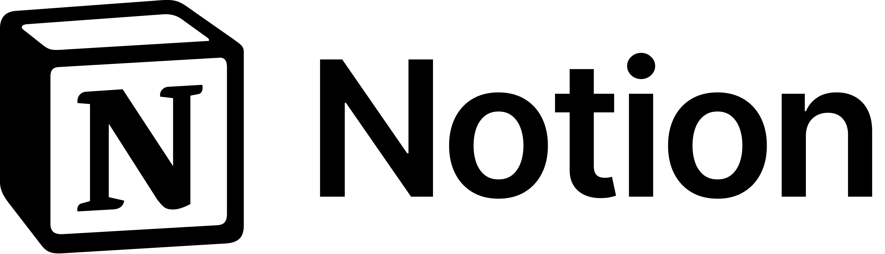
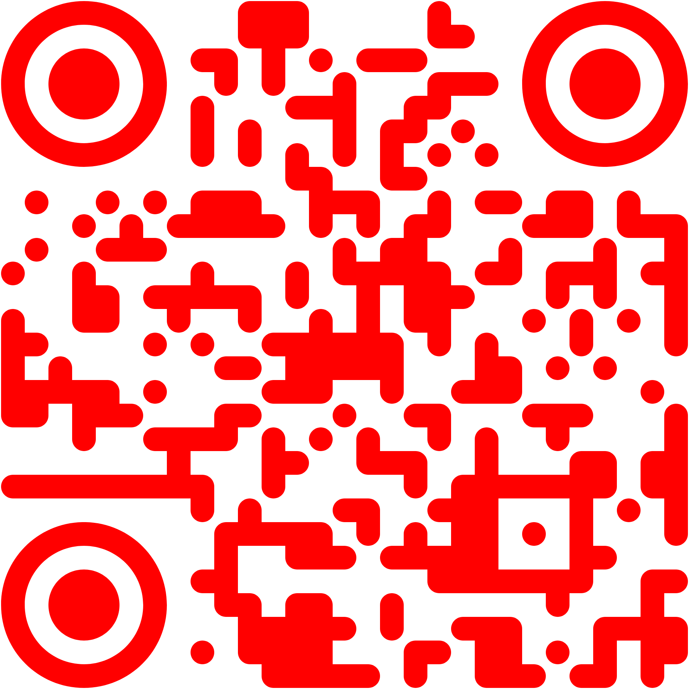
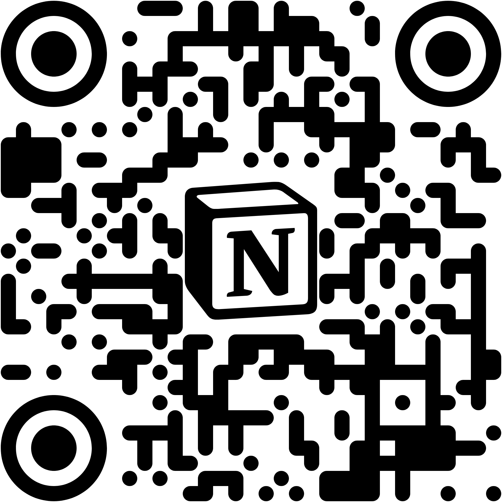
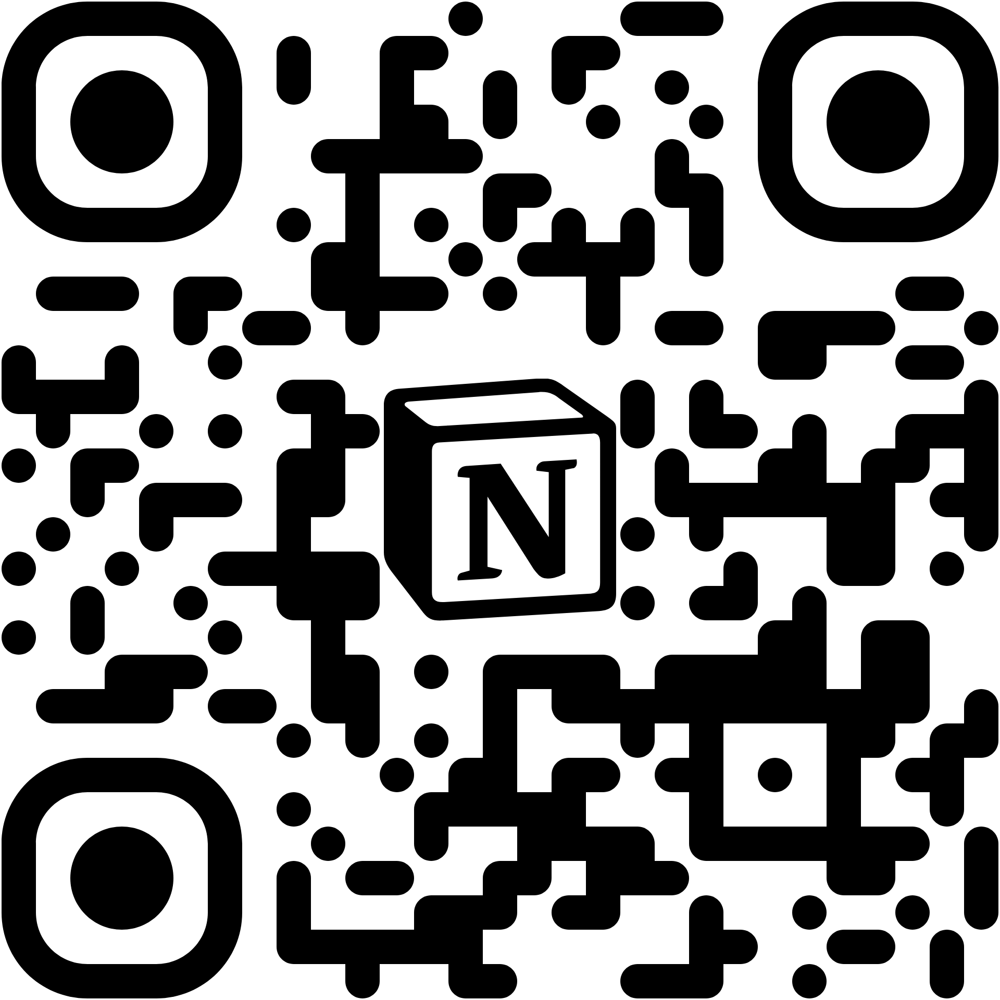

<!-- .slide: data-background-image="images/canva-down.png" data-background-size="cover" data-background-position="center" -->

--

<!-- .slide: data-background-image="images/canva-down2.png" data-background-size="cover" data-background-position="center" -->

---

# Inside the Blueprint

### Documenting Ideas into Working Systems

 
Presented by Angelo Laus 
a Notion Campus Leader

--

## I am Angelo Laus

--

<!-- .slide: data-background-image="images/gelo-stack.png" data-background-size="cover" data-background-position="center" -->

--

---

## Agenda
40 Minutes from Zero to Presentation
* **00:05** - Onboarding & Upgrading
* **00:15** - Engineering Workflows
* **00:25** - Leveraging Notion AI
* **00:35** - Instant Delivery (Notion Slides)

---

# Onboarding & Upgrading
Get your workspace ready.

--

### The Setup Checklist
1. Create a Notion account
2. Download the Desktop app
3. Register your `.edu.ph` email for a **Free Plus Plan**

--

--

<!-- .slide: data-background-image="images/activation-step1.png" data-background-size="cover" data-background-position="center" -->

--

<!-- .slide: data-background-image="images/activation-step2.png" data-background-size="cover" data-background-position="center" -->

--

<!-- .slide: data-background-image="images/activation-step3.png" data-background-size="cover" data-background-position="center" -->

--

<!-- .slide: data-background-image="images/activation-step4.png" data-background-size="cover" data-background-position="center" -->

--

<!-- .slide: data-background-image="images/activation-step5.png" data-background-size="cover" data-background-position="center" -->

--

<!-- .slide: data-background-image="images/activation-step6.png" data-background-size="cover" data-background-position="center" -->

--

--

## 🎁 Challenge

--

## 🎁 Challenge
The first 5 people to show me their upgraded Student Workspace get exclusive Notion stickers.

---

# Engineering Workflows
Notion is not a notepad. It's a relational database system.

--

## Case Study: Notion Events Around the World
* **The Challenge:** Managing scale.
* **The Solution:** A master events database.
* **The Result:** A seamless review process for thousands of events globally, featuring automation for feedback, emails, grant distribution, and more.

--

## Visual Architecture
* **Aesthetics == Efficiency:** Clean layouts reduce cognitive load.
* **Clutter Control:** Use toggles and synced blocks to keep the "Blueprint" readable.
* **BLUF:** Keep high-level summaries at the top of every page.

--

---

# Leveraging Notion AI
Accelerating the "Idea to Working System" pipeline.

--

### Turning Chaos into Order
Documentation often fails because it takes too long to write. 
AI removes the "blank page" friction.

--

### Practical AI Workflows
Try these prompts for instant documentation:
* *"Analyze these meeting notes and generate a technical project roadmap."*
* *"Refactor this messy brainstorm into a structured BRD (Business Requirements Document)."*
* *"Create a testing plan based on these feature descriptions."*

---

# The Pitch
Documentation is only valuable if it can be communicated.

--

### Notion Slides
The "Blueprint" doesn't just store data; it presents it. 
Stop wasting time copy-pasting into PowerPoint.

--

### The "Zero-Effort" Slide Logic
* **Structure:** Your Heading hierarchy (`H1`, `H2`) sets the rhythm.
* **Flow:** Dividers (`---`) create the transitions.
* **The Goal:** Focus on the *content* of the blueprint, and let the software handle the *presentation*.

--

### Live Deployment
Converting a complex project page into a professional pitch in a few minutes.

---

# Q&A and Closing
**Stay Productive.** 
Build Systems, not just notes.

---

No, I never tried creating my deck in Canva nor Google Slides to show how easily we can use Gemini to create slides nowadays.

---

# Connect with Me!

--

<!-- .slide: data-background-image="images/merry-bday.png" data-background-size="cover" data-background-position="center" -->

---

# Inside the Blueprint

### Documenting Ideas into Working Systems

 
Presented by Angelo Laus 
a Notion Campus Leader